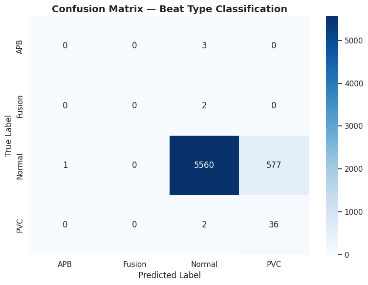
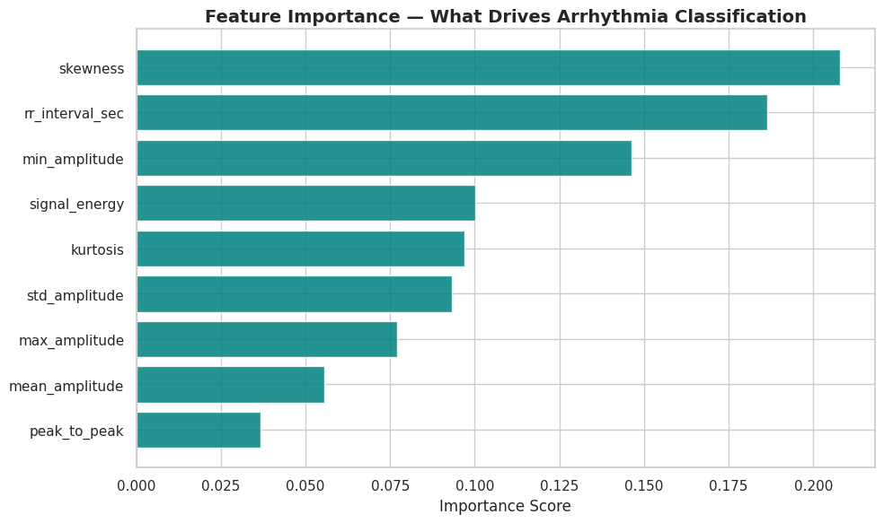
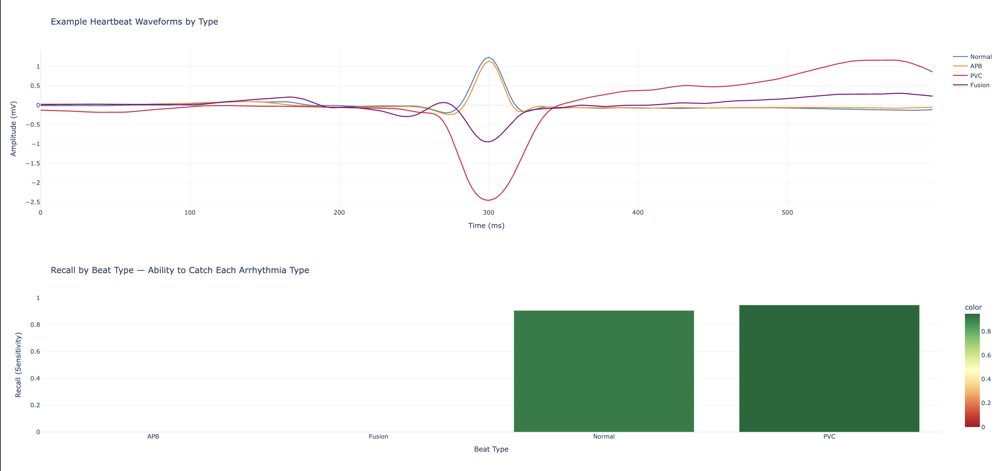

# ECG Arrhythmia Detection Pipeline

**Biomedical signal processing + machine learning pipeline for cardiac arrhythmia detection from real clinical ECG data.**

[](https://www.python.org/)
[](LICENSE)
[](https://colab.research.google.com/github/Dhyaneshbhatt1408/ecg-arrhythmia-detection/blob/main/Heart_Rhythm_Analysis.ipynb)

---

## Overview

This project builds an end-to-end pipeline that detects and classifies cardiac arrhythmias from raw ECG signals, using the **MIT-BIH Arrhythmia Database** — the benchmark dataset used in published cardiology and biomedical engineering research.

The pipeline mirrors real clinical signal-processing workflows: filtering noisy biosignals, detecting individual heartbeats, extracting physiologically meaningful features, and classifying beat types with a focus on **clinically meaningful evaluation** rather than raw accuracy.

## Key Features

- **Real clinical data** — sourced directly from PhysioNet via the `wfdb` library, the same tool used in published cardiology research
- **Biomedical signal processing** — Butterworth bandpass filtering to remove baseline wander and powerline interference
- **Beat-level segmentation** — heartbeat extraction using expert cardiologist annotations as ground truth
- **Interpretable feature engineering** — time-domain statistical features (amplitude, skewness, kurtosis, RR interval) rather than an opaque end-to-end model
- **Patient-level train/test split** — prevents data leakage by ensuring no patient appears in both training and test sets
- **Clinically weighted evaluation** — per-class sensitivity/recall reported explicitly, since missing a dangerous arrhythmia carries a different cost than a false alarm

## Methodology

| Stage | Technique |
|---|---|
| Data acquisition | PhysioNet MIT-BIH Arrhythmia Database (`wfdb`) |
| Preprocessing | Butterworth bandpass filter (0.5–40 Hz), zero-phase filtering (`filtfilt`) |
| Beat segmentation | Fixed-window extraction centered on annotated R-peaks |
| Feature extraction | Statistical shape features + RR interval timing |
| Model | Random Forest (200 trees, class-balanced) |
| Validation | Patient-level split (leakage-safe) |
| Evaluation | Per-class precision/recall/F1, confusion matrix, feature importance |

## Results

- - Trained and evaluated across 10 real patient records, all successfully downloaded and processed
- Evaluation focused on **recall per arrhythmia type** rather than aggregate accuracy, due to severe class imbalance toward normal beats
- Full classification report, confusion matrix, and feature importance rankings included in the notebook





## Tech Stack

`Python` · `wfdb` · `NumPy` · `SciPy` · `pandas` · `scikit-learn` · `Matplotlib` · `Seaborn` · `Plotly`

## Getting Started

```bash
pip install wfdb numpy scipy pandas scikit-learn matplotlib seaborn plotly tabulate
```

Open `Heart_Rhythm_Analysis.ipynb` in Jupyter or Google Colab (badge above) and run all cells — the notebook downloads data live from PhysioNet, no manual dataset download required.

## Limitations & Future Work

MIT-BIH is a relatively small, decades-old dataset recorded from a limited patient population at a single institution. This is a research and educational pipeline, **not a validated diagnostic tool**. A production deployment would require:

- A substantially larger and more demographically diverse dataset
- Prospective clinical validation
- Regulatory clearance via the appropriate FDA pathway (510(k) or De Novo)

Planned extensions: expanding to the full 48-record dataset, incorporating frequency-domain (wavelet) features, and benchmarking against a 1D-CNN on raw waveforms.

## Data Source

[MIT-BIH Arrhythmia Database](https://physionet.org/content/mitdb/1.0.0/) — PhysioNet, accessed via the `wfdb` Python package.

## License

MIT License — see [LICENSE](LICENSE) for details.
